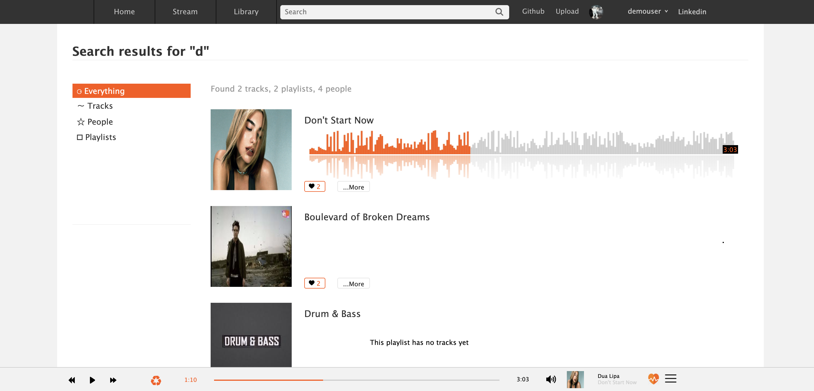

<p align='center'>
  
</p>

## Overview

CloneCloud is a pixel perfect clone of the audio distribution and music sharing platform SoundCloud. This was inspired by love for and background in music.

<a href="https://soundcloudclone1.herokuapp.com/#/">Live Demo</a>

## Technologies
* Ruby 
* JavaScript
* Rails 
* React.js
* Redux
* PostGreSQL
* AWS S3
* Wavesurfer.js
* CSS
* HTML
* Heroku

## Features 
* User authentication
* CRUD for Music
* CRUD for Playlists
* Continuous Audio Player
* User Dashboard
* Song Dashboard
* Playlist Dashboard
* Search Bar
* Waveforms 
* Comments
* Likes
* Follows
* Optional login

## Code Highlights

### Synchronized Wavesufer and Audio Player

I built a dynamic Wavesurfer that runs in sync with the audio player. Users to have the option to either click on the media player to change the place of the song they are in or by clicking the Wave itself. 

This is determined by how far left you clicked inside the div and is divided by the total width of the div. This would get you how far you clicked into a song in terms of percent. This is sent to the media player component as a WaveEvent This similarly works when you click on the media player and it changes the location of the wave.

```JavaScript
getPosition(el) {
    return el.getBoundingClientRect().left;
  }

handleWave(e) {
  e.preventDefault()
  let timeline = document.getElementById(`waveformsong${this.props.song.id}`)
  let numerator = (e.clientX - this.getPosition(timeline))
  let denominator = (timeline.clientWidth);
  let wholething = (part1/part2)
  this.props.waveEvent(song_position)
}
```


### Dynamic Search

User have the ability when searching to have all the options of Users, Playlists or Songs show up below the search bar that match either the title or username. When you select 'search for', you can filter specfically by users, playlists or songs on the side. 

Search Controller
```Ruby
    @songs = [Song.search(params[:search])]
    @songs = @songs.flatten
    @songs = @songs.map {|id| Song.find_by(id: id)}

    @playlists = [Playlist.search(params[:search])]
    @playlists = @playlists.flatten
    @playlists = @playlists.map { |id| Playlist.find_by(id: id)}

    @users = [User.search(params[:search])]
    @users = @users.flatten
    @users = @users.map {|id| User.find_by(id: id)}
    @searched = @songs + @playlists + @users
    render :index
```

Example Search Method
```Ruby 
 def self.search(search)
    songs = Song.where("lower(title) LIKE ?", "#{search.downcase}%").select("id") +  Song.where("lower(title) LIKE ?", "% #{search.downcase}%").select("id") 
    songs.map {|song| song.id }
  end
```



