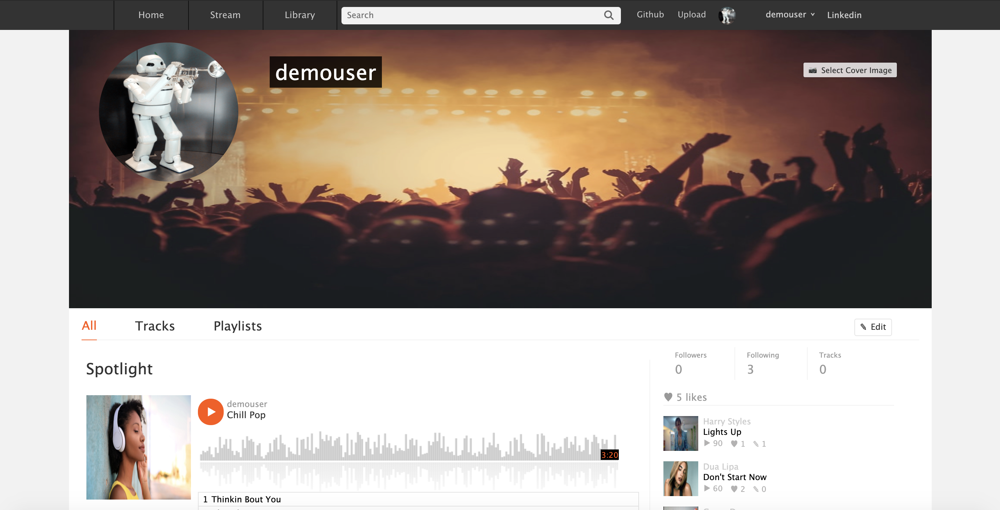
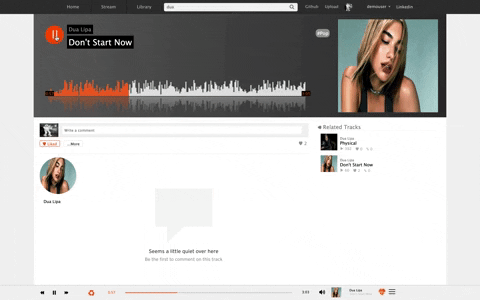
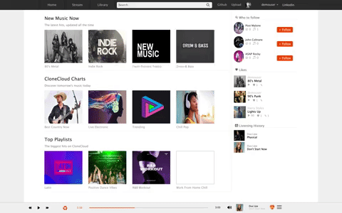

<p align='center'>
  
</p>

## Overview

CloneCloud is a pixel perfect clone of the audio distribution and music sharing platform SoundCloud. This was inspired by love for and background in music.

<a href="https://soundcloudclone1.herokuapp.com/#/">Live Demo</a>

## Technologies
* Ruby 
* JavaScript
* Rails 
* React.js
* Redux
* PostGreSQL
* AWS S3
* Wavesurfer.js
* CSS
* HTML
* Heroku

## Features 
* User authentication
* CRUD for Music
* CRUD for Playlists
* Continuous Audio Player
* User Dashboard
* Song Dashboard
* Playlist Dashboard
* Search Bar
* Waveforms 
* Comments
* Likes
* Follows
* Optional login

## Code Highlights

### Synchronized Wavesufer and Audio Player

I built a dynamic Wavesurfer intergrated with the current audio file playing. I wanted users to have the option to either click on the song bar? to change the current time of the song they are listening to, or the visualizaiton of the songwave. 

When you click on the wave, it automatically will start the wave from the given location you select. But in this, I find the distance you are from the start of the container and divide it by the whole length of the container. This will give you how far into the song you are. That percentaged is passed in as a WaveEvent, the WaveEvent is set as the currenttime of the song and the timer on the bar changes based on that. 

Similarly on the other end, when you click on the continuous play bar if passes over a percentage to the Wave Component in an UpdateWave function

```JavaScript
getPosition(el) {
    return el.getBoundingClientRect().left;
  }

handleWave(e) {
  e.preventDefault()
  let timeline = document.getElementById(`waveformsong${this.props.song.id}`)
  let numerator = (e.clientX - this.getPosition(timeline))
  let denominator = (timeline.clientWidth);
  let wholething = (part1/part2)
  this.props.waveEvent(song_position)
}
```



### Dynamic Search

Basically if you search soemthing. it will pull together in the search controller search for titles of songs and playlists.. then 
send back all of the users, playlists and songs with those and show them as you add another letter
can click on the searhc button to see it all show up on one page
pull based off of individual words as well 


Search Controller
```Ruby
    @songs = [Song.search(params[:search])]
    @songs = @songs.flatten
    @songs = @songs.map {|id| Song.find_by(id: id)}

    @playlists = [Playlist.search(params[:search])]
    @playlists = @playlists.flatten
    @playlists = @playlists.map { |id| Playlist.find_by(id: id)}

    @users = [User.search(params[:search])]
    @users = @users.flatten
    @users = @users.map {|id| User.find_by(id: id)}
    @searched = @songs + @playlists + @users
    render :index
}
```

Example Search Method
```Ruby 
 def self.search(search)
    songs = Song.where("lower(title) LIKE ?", "#{search.downcase}%").select("id") +  Song.where("lower(title) LIKE ?", "% #{search.downcase}%").select("id") 
    songs.map {|song| song.id }
  end
```


